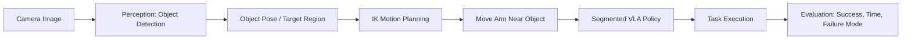

# Object-Aware SO101 Robot Manipulation

This is the project README for our TECHIN 517 course project. Our goal is to build a general object manipulation pipeline for the bi-manual SO101 robot arms. The system first uses perception to identify the target object, then uses inverse kinematics (IK) to move the arm near the object, and finally runs segmented VLA policies to complete the manipulation task.

https://github.com/user-attachments/assets/9e76d871-369a-476a-ad68-a44385a65b1b

https://github.com/user-attachments/assets/c3de2f02-e59c-4f3f-a1ee-6fb77bff705e

https://www.youtube.com/watch?v=2hf9C5P34AI&t=22s

The project combines the three types of methods required by the course:

- **Computer Vision / Perception**: detect the target object from camera images and estimate its location in the workspace.
- **Classical Robotics / IK**: use the detected object location to move the robot arm to a good pre-manipulation pose.
- **Robot Learning / VLA**: split the full task into shorter action segments, collect demonstrations for each segment, and train VLA policies to improve reliability.

## System Overview

The high-level workflow is:

1. Capture an image of the workspace using the camera.
2. Use the perception module to detect the target object and estimate its target region or center point.
3. Use IK to compute reachable robot joint angles and move the end effector near the object.
4. Switch to the VLA policy once the robot reaches the pre-manipulation pose.
5. Execute the task through segmented VLA policies, such as aligning, grasping, moving, and placing.
6. Record success rate, completion time, and failure mode for each trial.

## Method

### Perception

The perception module helps the robot understand where the target object is. It takes camera images as input, detects the object, and converts the detection result into a target region that can be used by the robot. This output is passed to the IK module so the robot can first move close to the object instead of relying on the VLA policy to learn the entire task from arbitrary starting positions.

### IK Motion

The IK module handles the coarse positioning step before the learned policy begins. Based on the target point from perception, the robot computes a reachable arm configuration and moves to a pre-manipulation pose near the object. This reduces the range of behavior that the VLA policy needs to learn, keeps the training data more focused, and improves safety and repeatability.

### Segmented VLA Training

Instead of training one long policy for the entire task, we divide the manipulation process into shorter VLA segments. IK brings the arm near the object first, and the VLA policies focus on the finer manipulation steps. Example segments include:

- Segment 1: align with and contact the target object
- Segment 2: grasp, push, or otherwise manipulate the object
- Segment 3: move the object to the target region
- Segment 4: release the object and return to a safe pose

Each segment can be demonstrated, trained, and evaluated separately. This makes the training process easier to debug because failures can be traced to a specific stage of the task.

## Evaluation Plan

Following the course project requirements, we plan to evaluate the system with quantitative experiments. We will test at least three different states, such as different objects, different object positions, or different lighting conditions. Each state will be tested for at least 10 trials.

For each trial, we will record:

- Trial number
- State label
- Success / failure
- Task completion time
- Failure mode
- Notes

The main metrics are:

| Metric | Description |
| - | - |
| Success rate | Percentage of successful trials in each test condition |
| Completion time | Mean and standard deviation of successful trial times |
| Failure mode | Categories such as perception failure, IK unreachable, grasp failure, or timeout |

## Demo

Demo videos in this repo:

- [Demo video 1](./MicrosoftTeams-video.mp4)
- [Demo video 2](<./MicrosoftTeams-video%20(1).mp4>)

## Setup

This project is based on the TECHIN 517 SO101 / LeRobot / ROS2 workflow.

Recommended setup:

1. Open the repository in the provided dev container.
2. Connect the SO101 leader and follower arms.
3. Load or calibrate the arm configuration files.
4. Build the ROS2 workspace if custom packages are added.
5. Download the trained VLA model from Hugging Face once it is uploaded.

Model link:

- TODO: add Hugging Face model URL

## Usage

High-level run sequence:

1. Start the robot bringup.
2. Start the perception pipeline.
3. Run IK motion to move the arm near the detected object.
4. Switch to the VLA controller or policy server.
5. Execute the selected VLA segment.
6. Record the result of each trial for evaluation.

## Quantitative Results

TODO: add final experiment data and charts.

Expected final files:

- `results/trials.csv`
- success-rate chart or table
- timing summary
- failure mode analysis

## Team Contributions

TODO: add team member names and contributions.

## Acknowledgements

This project builds on the TECHIN 517 course materials and the following tools:

- SO101 robot arms
- LeRobot
- ROS2
- ros2_control
- Rosetta policy deployment workflow
