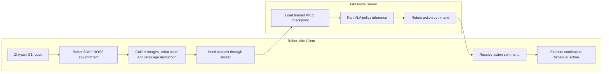

# End-to-End VLA Bimanual Robot System for Household Tabletop Tidying and Cleaning

This internship project focused on developing an end-to-end Vision-Language-Action (VLA) bimanual robot manipulation system for household tabletop tidying and cleaning. The target scenarios included tabletop organization, trash pickup, object relocation, towel folding, pouring, and surface wiping.

https://github.com/user-attachments/assets/c4618757-40f3-433a-9c63-6d7bfb8e9b50

https://github.com/user-attachments/assets/ebad7b00-0e8a-4648-8146-ccf82ecd7799  https://github.com/user-attachments/assets/daecb038-145c-44d1-a656-4f0c700515ec

https://github.com/user-attachments/assets/5dd247d2-31cd-4489-8c69-86ab14947d3f  https://github.com/user-attachments/assets/dfc43153-44e6-42ec-84ed-2afee8a2be52

https://github.com/user-attachments/assets/a687328e-67ef-40b9-8c07-3cadc2ccc4f5

## Project Background

Household tabletop environments are challenging because objects vary in category, shape, pose, and location. Task sequences can also be complex, and cleaning motions such as wiping require stable contact interaction with the environment.

Traditional rule-based grasping and planning pipelines usually require manually designed logic for each object type, task, and scene layout. This makes the system difficult to scale and weakens its ability to generalize to new tabletop configurations.

This project explored an end-to-end VLA approach that maps multi-view visual observations, language instructions, and robot state directly to continuous bimanual actions on the Zhiyuan G1 humanoid robot.

## Pipeline Overview

The project pipeline contains four main stages: real-robot demonstration collection, data processing, model training, and real-robot deployment with client-server inference.

```mermaid
flowchart LR
    subgraph S1["Stage 1: Real-robot Demonstration Collection"]
        A1["Zhiyuan G1 humanoid robot"]
        A2["VR teleoperation\nheadset + controllers"]
        A3["Household tabletop tasks\ntrash pickup, object relocation,\ntowel folding, pouring, wiping"]
        A4["Raw demonstrations\nmulti-view images, robot state,\ngripper state, language instruction"]
        A1 --> A2
        A2 --> A3
        A3 --> A4
    end

    subgraph S2["Stage 2: Data Processing"]
        B1["Download raw data\nto GPU workstation"]
        B2["Parse trajectories\nimages, joint states, gripper states,\ntask instructions"]
        B3["Compute end-effector pose\nfrom arm joint states"]
        B4["Clean trajectories\nremove failed, noisy, or abnormal segments"]
        B5["Convert to LeRobot format"]
        B6["Compute normalization stats\nmin, max, mean, std"]
        B1 --> B2 --> B3 --> B4 --> B5 --> B6
    end

    subgraph S3["Stage 3: Model Training"]
        C1["PI0.5 full fine-tuning"]
        C2["Training setup\n8 x A100 GPUs, batch size 256,\n30k steps, about 9 hours"]
        C3["Simulation validation\nLIBERO multi-task evaluation"]
        C4["Fine-tuned checkpoint"]
        C1 --> C2 --> C3 --> C4
    end

    subgraph S4["Stage 4: Real-robot Deployment and Inference"]
        subgraph CLIENT["Robot-side Client"]
            D1["Start robot SDK / ROS2 environment"]
            D2["Collect observations\nmulti-view images + robot state"]
            D3["Send observations and instruction\nthrough socket"]
            D6["Receive continuous bimanual actions"]
            D7["Execute actions on G1 robot"]
        end

        subgraph SERVER["GPU-side Server"]
            D4["Load PI0.5 checkpoint"]
            D5["Run policy inference"]
        end

        D1 --> D2 --> D3 --> D4 --> D5 --> D6 --> D7
    end

    A4 --> B1
    B6 --> C1
    C4 --> D1
```

## Core Contributions

### 1. End-to-end VLA Training and Deployment Pipeline

I reproduced and adapted the full PI0.5 training and deployment workflow for a real bimanual robot system. The completed pipeline covered:

- Teleoperation-based real-robot data collection
- Raw data download, parsing, and preprocessing
- Conversion to LeRobot-compatible format
- Normalization statistics generation
- PI0.5 full fine-tuning
- Policy module adaptation
- Client-server real-robot inference and testing

For the Zhiyuan G1 humanoid robot, the system connected multi-view image observations and language instructions to continuous bimanual action outputs in an end-to-end policy inference loop.

### 2. Household Task Decomposition and Multi-stage Data Collection

The household tabletop scenario was decomposed into smaller atomic tasks to make data collection, training, and debugging more manageable.

Atomic tasks included:

- Trash pickup
- Object picking
- Object relocation
- Towel folding
- Pouring water
- Tabletop wiping

Demonstrations were collected with a VR teleoperation setup using a headset and controllers. The dataset covered different object positions, lighting conditions, object shapes, and tabletop layouts. I also worked on trajectory cleaning, abnormal segment filtering, data processing, and normalization.

### 3. Simulation and Real-robot Validation

On the simulation side, I trained and evaluated multi-task policies in LIBERO to validate the training pipeline and policy behavior before real-robot deployment.

On the real-robot side, I designed tabletop test scenes with different layouts and object combinations, then evaluated the PI0.5 policy using quantitative metrics such as task success rate, grasp success rate, placement accuracy, wiping coverage, execution time, and failure type.

## Real-robot Data Collection and Processing

### Hardware Setup

The real-robot platform was the Zhiyuan G1 humanoid robot. Data was collected through a VR teleoperation setup, where the operator used a headset and controllers to guide the robot arms and trigger grasping or release actions.

Reference teleoperation style:

- [VR teleoperation reference video](https://www.bilibili.com/video/BV1w5KwzVEyS/?vd_source=50ca452bc3880ac032e27f9f42cb2a32)

### Data Collection Workflow

A typical data collection workflow was:

1. Publish a task on the Zhiyuan platform.
2. Start the collection process from the robot-side interface.
3. Teleoperate the robot through the required trajectory, such as pick, move, and place.
4. Collect around 50-100 demonstrations for a single task such as Pick and Place.
5. Cover different object positions, object shapes, and initial states.
6. Download the collected data to the GPU workstation for processing and training.

### Data Quality Requirements

Data quality was one of the most important factors affecting VLA policy performance. During collection, the main requirements were:

- Keep robot trajectories smooth and avoid sudden jumps.
- Avoid assigning conflicting ground-truth actions to the same visual observation and robot state.
- Avoid moving the arm back through exactly the same path when returning from one point to another, because this can create ambiguous state-action pairs.
- Filter or annotate failed trajectories, incomplete episodes, and abnormal motion segments.

If identical observations and robot states correspond to different next actions, the imitation learning model may learn an unstable policy. This can lead to poor convergence or unreliable real-robot behavior.

### Data Format Conversion

After downloading raw data from the Zhiyuan platform, the processing pipeline included:

1. Parse joint states, gripper states, camera images, and task instructions.
2. Convert arm joint poses into end-effector poses.
3. Convert the dataset into LeRobot format.
4. Compute max, min, mean, and standard deviation for each action and observation dimension.
5. Save the normalization file so training and deployment use consistent data distributions.

## Model Training Strategy

The project used PI0.5 full fine-tuning. The reference training configuration was:

| Item | Configuration |
| - | - |
| Model | PI0.5 |
| Training mode | Full fine-tuning |
| Hardware | 8 x A100 GPUs |
| Batch size | 256 |
| Training steps | 30k |
| Estimated training time | About 9 hours |

For simpler Pick and Place tasks, PI0.5 can achieve a high success rate when the demonstrations are clean and consistent. In this project, data quality was often more important than simply increasing the number of demonstrations.

## Deployment Architecture

Real-robot deployment used a client-server architecture.

### GPU Server

The GPU server loaded the trained checkpoint and handled model inference. The robot side did not need to run the large model locally, which reduced compute requirements on the physical robot.

### Robot Client

The robot client connected to the robot in developer mode, started the required SDK and ROS2 environment, then ran the test script. The client sent multi-view observations, robot state, and language instruction to the GPU server through socket communication. After receiving the predicted action from the server, it forwarded the command to the robot for execution.

## Evaluation

The system was evaluated in both simulation and real-robot settings.

### Simulation Evaluation

LIBERO was used for multi-task training and evaluation to validate the data format, training code, checkpoint loading, and policy inference behavior.

### Real-robot Evaluation

Real-robot tests were conducted under different tabletop layouts, object combinations, and task instructions. Each trial recorded:

- Trial number
- Task type
- Object layout
- Success or failure
- Execution time
- Failure mode
- Notes

Main metrics:

| Metric | Description |
| - | - |
| Task success rate | Percentage of trials where the full task was completed |
| Grasp success rate | Percentage of trials where the target object was successfully grasped |
| Placement accuracy | Whether the object was placed in the target region |
| Wiping coverage | Percentage or qualitative coverage of the target wiping area |
| Execution time | Time required to finish the task |
| Failure type | Failure categories such as perception issue, grasp failure, collision, timeout, or unstable contact |

## Key Takeaways

- Built a full VLA workflow from teleoperation data collection and processing to PI0.5 fine-tuning and real-robot deployment.
- Connected multi-view vision, language instruction, and continuous bimanual control on the Zhiyuan G1 humanoid robot.
- Improved training controllability by decomposing household tabletop tasks into smaller atomic skills.
- Validated the policy in both LIBERO simulation and real-robot tabletop scenarios.
- Evaluated model robustness using success rate, grasp success rate, placement accuracy, wiping coverage, execution time, and failure-mode analysis.
